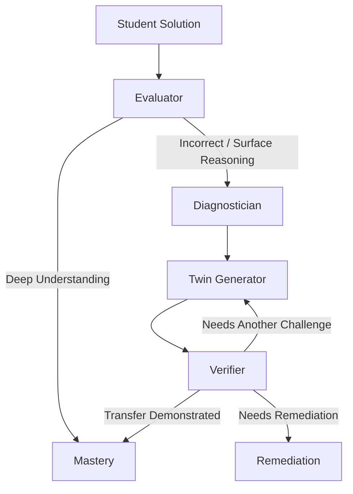

# ConceptTwin

An adaptive, multi-agent AI assessment platform designed to verify deep conceptual transfer and eliminate rote pattern-matching in competitive physics learning.

---

## Overview

ConceptTwin helps students move beyond formula memorization and surface-level pattern matching. It does this by evaluating their step-by-step physical reasoning, identifying specific conceptual gaps, generating structurally equivalent "twin" problems, and verifying whether the student can successfully transfer the underlying concept to a new scenario.

---

## The Problem

1.  **Rote Pattern Mimicry**: Students preparing for high-stakes exams (like JEE and NEET) often solve familiar question formats by reproducing memorized formulas and substituting values, without genuinely understanding the core physics invariants.
2.  **Opacity of Correct Answers**: A student can arrive at a correct numerical answer through flawed steps, lucky guesses, or incorrect assumptions (such as assuming normal force always equals gravity ($N = mg$)). Traditional portals mark this as mastery, creating a false positive.
3.  **Scale Limitation**: It is impossible for teachers to manually audit and diagnose the handwritten calculations of thousands of students to identify root conceptual gaps at scale.
4.  **Typed Input Bottleneck**: Online testing platforms force students to type complex LaTeX-style derivations. In physics, students naturally work out steps with pen and paper, making online portals text-focused instead of reasoning-focused.

---

## The ConceptTwin Approach

ConceptTwin implements a closed-loop conceptual transfer assessment:

```
[Diagnostic PYQ] ──► [Student Solution (Typed/Handwritten)] ──► [AI Evaluation]
                                                                        │
                                            ┌───────────────────────────┴───────────────────────────┐
                                            ▼                                                       ▼
                                     [Deep Mastery]                                        [Rote Pattern Detected]
                                            │                                                       │
                                     (Unlock Module)                                       [Concept Gap Diagnosis]
                                                                                                    │
                                                                                           [ConceptTwin Served]
                                                                                                    │
                                                                                           [Transfer Test Pass]
```

Unlike static systems that generate random questions, a **ConceptTwin** preserves the identical deep mathematical structure and governing physics laws of the target concept while completely varying the surface framing (context, descriptors, objects). The student cannot rely on rote memory to solve the twin; they must demonstrate true transfer of understanding.

---

## Student Workflow

1.  **Onboarding**: The student initializes their profile (Class level, target exam like NEET or JEE) and selects their target concept.
2.  **Diagnostic Anchor**: The workspace renders an exam-level diagnostic problem, which can include custom vector physics diagrams.
3.  **Attempt Submission**: The student writes their steps and final answer in the typed math editor, or uploads/drags a photo of their handwritten notepad.
4.  **Multimodal Analysis**: For photo submissions, a server-side API processes the image using Gemini Vision to extract derivations, numerical values, and formulas into an editable workspace text area.
5.  **AI Evaluation**: The Evaluator agent transcribes the reasoning steps and checks the correctness of the calculations.
6.  **Concept Diagnosis**: If reasoning gaps or surface pattern-matching are detected, the Diagnostician agent isolates the specific conceptual misconception.
7.  **Isomorphic Twin Generation**: The Twin Generator creates a structurally equivalent problem in a new physical context.
8.  **Transfer Verification**: The Verifier checks the physical soundness of the twin before serving it, and then grades the student's transfer attempt.
9.  **Mastery Unlock**: Upon demonstrating conceptual transfer on the twin, the concept is marked as mastered, unlocking dependent topics on the subway path.

---

## Current Learning Scope

*   **Subject**: Physics (Class 11)
*   **Chapter**: Laws of Motion & Friction
*   **Curated Dataset**: 5 conceptual diagnostic problems covering:
    1.  Free-Body Diagrams & Force Identification
    2.  Newton's Second Law & Variable Forces
    3.  Friction Direction & Thresholds
    4.  Inclined Planes with Static Friction
    5.  Connected Bodies & Single-Pulley Systems
*   **Diagram Support**: Integrated vector SVG renderings for inclined planes, V-troughs, pulleys, and wall friction.

*Scalability Note*: The modular graph architecture and multi-agent pipeline are designed to scale to additional chapters, subjects, and larger database adapters.

---

## Handwritten Solution Analysis

To align with the natural workflow of physics problem solving, students can upload images of their paper scratchpads:

```
[Notepad Photo] ──► [POST /api/analyze-solution] ──► [Gemini Vision Model] 
                                                             │
                                                    [Zod Payload validation]
                                                             │
[Extracted Math Working & Answers] ◄── [Workspace Panel Review] ◄────┘
```

The system processes the image and extracts calculations, equations, and numerical values, using a quality guard to warn if the handwriting is illegible rather than making incorrect assumptions.

---

## Multi-Agent AI Architecture

The evaluation and generation workflow is orchestrated using **LangGraph** to coordinate state transitions:



### Agents Reference

*   **Evaluator** (`src/lib/agents/evaluator.ts`): Evaluates solution correctness and analyzes step derivations to check for rote patterns.
*   **Diagnostician** (`src/lib/agents/diagnostician.ts`): Isolates conceptual weaknesses and recommends remediation directions.
*   **Twin Generator** (`src/lib/agents/twin-generator.ts`): Synthesizes isomorphic physics challenges preserving governing invariants.
*   **Verifier** (`src/lib/agents/verifier.ts`): Validates physical/mathematical soundess of generated twins and evaluates student attempts on twins.

---

## Developer Guide & API Reference

### API Endpoints
1.  **`POST /api/session`**: Executes the LangGraph routing cycle.
2.  **`POST /api/analyze-solution`**: Extracts mathematical steps from handwritten images.

### Local Installation
1.  **Install dependencies**:
    ```bash
    npm install
    ```
2.  **Configure environment**: Create a `.env.local` containing your API key:
    ```env
    GEMINI_API_KEY=your-gemini-key
    ```
3.  **Run development server**:
    ```bash
    npm run dev
    ```

### Compilation & Quality Checks
Run these scripts to check code health:
```bash
npx tsc --noEmit
npm run lint
npm run build
```
