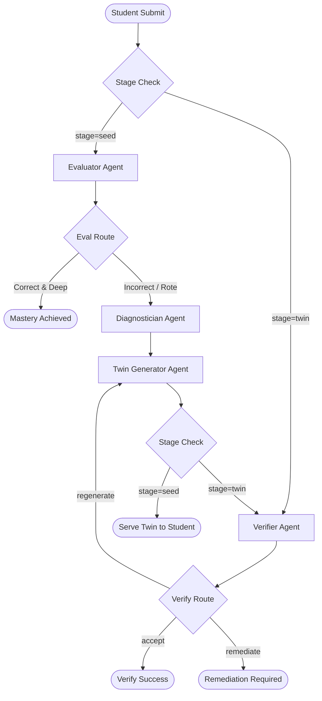

# ConceptTwin

An adaptive, multi-agent AI assessment platform designed to verify deep conceptual transfer and eliminate rote pattern-matching in competitive physics learning.

---

## 1. Introduction

ConceptTwin is a hackathon-grade AI tutoring workspace built specifically for students preparing for high-stakes, concept-heavy entrance examinations (such as JEE and NEET). 

Unlike conventional exam preparation portals that serve static banks of Multiple Choice Questions (MCQs), ConceptTwin implements a closed-loop multi-agent workflow. It evaluates not only the final numeric answer of a student but also the underlying step-by-step physical reasoning. If a student solves a question correctly but displays rote formula memorization (surface-level pattern matching) without deep conceptual understanding, the system diagnoses the gap and generates a **Conceptual Twin**—a structurally isomorphic problem set in a different visual and physical context—to test and establish genuine transfer understanding.

---

## 2. The Problem

For competitive examinations like JEE and NEET, physics questions are designed to test deep conceptual understanding. However, many students prepare by memorizing formulas, recognizing surface-level patterns, and matching similar variables without mastering the underlying physics models.

A student might solve a classic problem of a block sliding down an inclined plane using a memorized equation ($a = g\sin\theta$) without understanding how components of the normal force and gravity are resolved. Traditional MCQ platforms encourage this rote behavior: if the student clicks the correct option, the platform records "mastery." In reality, the student has not mastered the concept, leaving them vulnerable to slight variations in problem contexts or compound-force scenarios in actual exams.

---

## 3. The ConceptTwin Approach

ConceptTwin resolves this gap by introducing a transfer-based mastery model:

```
[Diagnostic PYQ] ──► [Student Solution (Typed/Handwritten)] ──► [Multi-Agent Evaluation]
                                                                        │
                                            ┌───────────────────────────┴───────────────────────────┐
                                            ▼                                                       ▼
                                     [Deep Mastery]                                        [Rote Pattern Detected]
                                            │                                                       │
                                     (Unlock Module)                                       [Diagnosis & Remediation]
                                                                                                    │
                                                                                           [ConceptTwin Generated]
                                                                                                    │
                                                                                           [Transfer Challenge]
```

The system ensures that the generated **ConceptTwin** is not just another random question. It preserves the exact mathematical and structural invariants of the core physics concept while varying the surface descriptors (context, numbers, objects, angles). True mastery is only recorded when a student demonstrates **conceptual transfer** by successfully solving the structural twin.

---

## 4. Core Learning Workflow

1.  **Student Onboarding**: The student registers their name, selects Class 11 or 12, specifies their target exam (JEE, NEET, or Boards), and selects a specific target concept.
2.  **Diagnostic Problem**: The workspace serves an exam-level Previous Year Question (PYQ) pattern from the concept database. At least 3 of these problems contain custom vector-based physics diagrams.
3.  **Student Solution Submission**: The student has two options to submit their response:
    *   **Type Solution**: Type step-by-step mathematical reasoning and final numeric value in the workspace text editor.
    *   **Upload Image**: Upload or drag-and-drop an image of their handwritten work (simulating solving a problem on a physical notepad).
4.  **Multimodal Analysis**: For image uploads, a server-side endpoint parses the handwritten solution using Gemini Vision, extracting mathematical working, numerical final answers, and governing formulas into a clean text block that the student can review and adjust before final submission.
5.  **AI Evaluation**: The solution is dispatched to the orchestration pipeline. The system evaluates both the numerical final answer and the step-by-step reasoning steps.
6.  **Concept Diagnosis**: If the solution fails or indicates rote memorization (correct answer but flawed/copied reasoning), the system identifies the specific conceptual gap.
7.  **ConceptTwin Generation**: An isomorphic twin problem is generated, matching the student's diagnosed weakness to enforce active learning.
8.  **Verification**: The generated twin is validated for physical correctness and mathematical integrity by the verifier before being displayed. Once attempted by the student, the verifier evaluates the transfer attempt.
9.  **Mastery Progression**: Upon demonstrating deep understanding of both the baseline and the twin problem, the concept is marked as mastered on the subway map sidebar, unlocking the next concept in the learning path.

---

## 5. Differentiators

*   **Closed-Loop Transfer Assessment**: Moves beyond simplistic right/wrong binary checks by requiring students to transfer understanding to a contextually unique twin.
*   **Structured Concept Diagnosis**: Pinpoints whether a failure is due to a calculation slip, a surface pattern-matching habit, or a deep physics model misconception.
*   **Multimodal Integration**: Allows students to upload handwritten work, recognizing that competitive physics derivations are naturally worked out with pen and paper.
*   **Inline Physics Diagrams**: Features custom-drawn, crisp vector SVG figures directly inside the browser, simulating high-stakes paper booklet visuals.
*   **Rigorous Verification**: Protects the student against hallucinated AI questions by running a double-pass verifier check before serving any generated problem.

---

## 6. Multi-Agent AI Architecture

ConceptTwin orchestrates four specialized agents built using `LangGraph` for state-managed, conditional routing:



### 1. Evaluator Agent (`src/lib/agents/evaluator.ts`)
*   **Responsibility**: Assesses the correctness of the final numerical answer and transcribes reasoning steps.
*   **Output**: Determines if the student demonstrated genuine understanding or acted as a surface-level pattern matcher.

### 2. Diagnostician Agent (`src/lib/agents/diagnostician.ts`)
*   **Responsibility**: Analyzes the student's step-by-step reasoning against common physics misconceptions and recommends a remediation strategy.
*   **Output**: Produces a structured conceptual gap diagnosis.

### 3. Twin Generator Agent (`src/lib/agents/twin-generator.ts`)
*   **Responsibility**: Creates a structurally identical challenge, maintaining mathematical relationships (governing invariants) while changing surface objects (e.g. block on incline $\rightarrow$ cargo box pulled up on a spaceship ramp).
*   **Output**: Isomorphic physics twin question.

### 4. Verifier Agent (`src/lib/agents/verifier.ts`)
*   **Responsibility**: Ensures the generated physics twin is physically solvable, mathematically correct, and structurally consistent. Also evaluates the student's subsequent attempt on the twin problem.
*   **Output**: Verification flag and transfer assessment score.

---

## 7. Multimodal Solution Analysis

Because physics students solve equations on paper, typing complex LaTeX-style derivations online can be frustrating. ConceptTwin implements a secure, server-side multimodal image parser:

```
[Student Notepad Image] ──► [POST /api/analyze-solution] ──► [Gemini Vision Model] 
                                                                    │
                                                           [Zod Validation]
                                                                    │
[Extracted Math & Final Answer] ◄── [Workspace Panel Review] ◄──────┘
```

The system processes the image and returns a structured JSON payload containing:
*   `extractedWorking`: Clean plain text/markdown transcription of the derivation.
*   `extractedFinalAnswer`: Transcribed final numeric or algebraic value.
*   `detectedEquations`: Mathematical formulas identified in the handwriting.
*   `isImageUnclear`: Quality guard. If the image is blurry or irrelevant, the system triggers a clean "image unclear" state instead of guessing.

---

## 8. Physics Problem System

The Laws of Motion diagnostic problem bank is defined in [`src/data/problems/index.ts`](file:///d:/MalMasala/ConceptTwin/src/data/problems/index.ts):

| Category / Concept Cluster | Seed Problem Description | Diagrams | Target Variable | Difficulty |
| :--- | :--- | :--- | :--- | :--- |
| **Free-Body Diagrams** | Uniform sphere nested inside an asymmetric $30^\circ$/$60^\circ$ V-shaped trough. | Yes (SVG) | Normal Force (N) | Medium |
| **Newton's Second Law** | Block pulled by a time-varying force $F(t) = 4t$ (requires integration). | No | Velocity (m/s) | Medium |
| **Friction & Direction** | Block pressed against a vertical wall with horizontal force ($F = 80$ N). | Yes (SVG) | Friction Force (N) | Hard |
| **Inclined Plane** | Block on a rough $37^\circ$ slope with static friction opposing sliding. | Yes (SVG) | Min holding force (N) | Medium |
| **Connected Bodies** | Block on tabletop connected via string to a hanging block over a pulley. | Yes (SVG) | Tension Force (N) | Medium |

All diagrams are rendered dynamically via the reusable [`PhysicsDiagram`](file:///d:/MalMasala/ConceptTwin/src/components/PhysicsDiagram.tsx) component using clean vector SVG/CSS shapes.

---

## 9. Visual Interface Design (UI/UX)

*   **Light-First Theme**: Styled on a warm off-white foundation (`#F8FAFA`), using an active brand cyan/teal accent (`#77FFFC` / `#008f8c`) and dark slate charcoal typography (`#1A2020`) for optimal reading.
*   **Subway Pathway Map**: Compact sidebar subway line mapping mastered and active nodes in real-time.
*   **Tutor Assessment Transition Overlay**: Centered glass-card loader overlay that locks inputs during processing, avoiding abrupt scroll shifts, and shows a rotating AI core orbit and progressive stage checklist.
*   **Slide-up Outcomes Drawer**: Smooth sliding panel utilizing CSS transitions (`animate-[slideUp_0.4s_ease-out_forwards]`) to display mistakes, scores, and next action parameters.

---

## 10. Technology Stack

| Technology Layer | Tool / Library | Version | Role in Project |
| :--- | :--- | :--- | :--- |
| **Frontend Core** | React / Next.js (App Router) | `19.2` / `16.3` | Application framework and UI layer |
| **Language** | TypeScript | `^5` | Type-safety and schema enforcement |
| **Styling** | Tailwind CSS | `^4` | Responsive styling and custom keyframe animations |
| **AI Models Provider** | Google GenAI SDK | `^2.19` | Gemini 3.6 Flash (Text & Vision API client) |
| **Agent Orchestration** | LangGraph | `^1.4` | Directed state-graph routing and memory |
| **Schema Validation** | Zod | `^4.5` | Strict type validation on AI and API payloads |

---

## 11. Project Directory Architecture

```
concept-twin/
├── src/
│   ├── app/
│   │   ├── api/
│   │   │   ├── session/               # Main LangGraph handler
│   │   │   └── analyze-solution/      # Multimodal image transcription
│   │   │   route.ts
│   │   ├── globals.css                # Color variables and keyframe transitions
│   │   ├── layout.tsx
│   │   └── page.tsx                   # Onboarding, Workspace, & outcomes UI
│   ├── components/
│   │   └── PhysicsDiagram.tsx         # Reusable SVG diagram renderer
│   ├── data/
│   │   ├── concepts.ts                # Prerequisite concept relationships
│   │   └── problems/                  # Diagnostic JEE physics database
│   │       └── index.ts
│   ├── lib/
│   │   ├── agents/                    # Evaluator, Diagnostician, TwinGen, Verifier
│   │   ├── ai/                        # Central Gemini client config & prompts
│   │   │   └── gemini.ts
│   │   └── orchestration/             # LangGraph StateGraph & reducing channels
│   │       ├── graph.ts
│   │       └── state.ts
│   └── types/
│       └── physics.ts                 # Authoritative physics interface definitions
├── package.json
└── tsconfig.json
```

---

## 12. API Endpoints

### 1. `POST /api/session`
Executes the main LangGraph learning cycle.
*   **Request Schema (Zod)**:
    ```typescript
    {
      sessionId?: string;
      stage: 'seed' | 'twin';
      problemId: string;
      working: string;
      finalAnswer: number | string;
      twinId?: string;
      twinProblem?: ApiTwinProblem;
    }
    ```
*   **Response Payload**:
    ```typescript
    {
      ok: true,
      sessionId: string,
      stage: 'seed' | 'twin',
      masteryLevel: 'unknown' | 'developing' | 'surface' | 'mastered' | 'needs_remediation',
      nextAction: 'mastered' | 'show_twin' | 'twin_accepted' | 'remediation' | 'error',
      evaluation?: ApiEvaluationResult,
      diagnosis?: ApiDiagnosisResult,
      twin?: ApiTwinProblem,
      verification?: ApiVerificationResult
    }
    ```

### 2. `POST /api/analyze-solution`
Transcribes handwritten work.
*   **Request Schema (Zod)**:
    ```typescript
    {
      image: string;      // Base64-encoded string
      mimeType: string;   // e.g. "image/png"
      question: string;   // Contextual problem prompt
    }
    ```

---

## 13. Security, Performance & Rate Limiting

*   **Secure Client Access**: The client never communicates directly with the Gemini API. The API key remains strictly server-side.
*   **Global Request Queue**: All calls to the Gemini API are enqueued in `globalGeminiQueue` inside `src/lib/ai/gemini.ts` to execute sequentially, separating consecutive requests by at least 1.5 seconds.
*   **Nested-Retry Abort**: When encountering rate limits (429), `generateText` handles retries (up to 2 times, pausing 2s/5s or respecting `retry-after` header directives). The calling `callWithRetry` JSON parser aborts immediately on `429` errors to prevent nested loop amplification.
*   **Session Concurrency Lock**: In `src/app/api/session/route.ts`, an active session tracking lock immediately blocks overlapping concurrent requests for the same `sessionId`.

---

## 14. Local Development

### 1. Prerequisites
*   Node.js (v18.x or higher)
*   A Gemini API key from [Google AI Studio](https://aistudio.google.com/app/apikey)

### 2. Installation
Clone the repository and install dependencies:
```bash
npm install
```

### 3. Environment Configuration
Create a local environment file:
```bash
cp .env.example .env.local
```
Edit `.env.local` and enter your Gemini key:
```env
GEMINI_API_KEY=your-api-key-here
```

### 4. Running the Development Server
```bash
npm run dev
```
Open [http://localhost:3000](http://localhost:3000) inside your web browser.

---

## 15. Validation & Compilation Commands

Run these standard scripts to verify code health:
```bash
# TypeScript compiler check
npx tsc --noEmit

# ESLint check
npm run lint

# Production compilation
npm run build
```

---

## 16. Scope & Future Roadmap

### Current Scope
*   Newton's Laws of Motion and Friction concept modules.
*   Multi-agent LangGraph evaluation pipeline.
*   Handwritten notes transcription using Gemini Vision.
*   Crisp vector SVG diagrams inside diagnostic problem cards.

### Future Roadmap
*   Support for additional physics chapters (e.g. Work-Energy-Power, Rotational Dynamics).
*   Visual dashboard for teacher tracking and conceptual gap heatmaps.
*   Historical tracking of student solution logs and performance analytics.
*   Enhanced handwriting math parser supporting complex multi-variable calculus symbols.

---

## 17. Limitations
*   The seed question database is currently restricted to 5 baseline Laws of Motion problems.
*   AI generation depends on Google Gemini rate limits and API availability.
*   Handwritten note transcription accuracy is highly dependent on image readability, lighting, and clarity.

---

## 18. Demo Link Placeholders

*   **Live Demo**: *[INSERT LIVE DEPLOYMENT URL]*
*   **Demo Video**: *[INSERT HACKATHON DEMO VIDEO URL]*
*   **GitHub Repository**: [https://github.com/ayush28gadve/Lv8.git](https://github.com/ayush28gadve/Lv8.git)

---

## 19. Team & Credits

Built for the **Advanced AI Hackathon** by the ConceptTwin Development Team.
