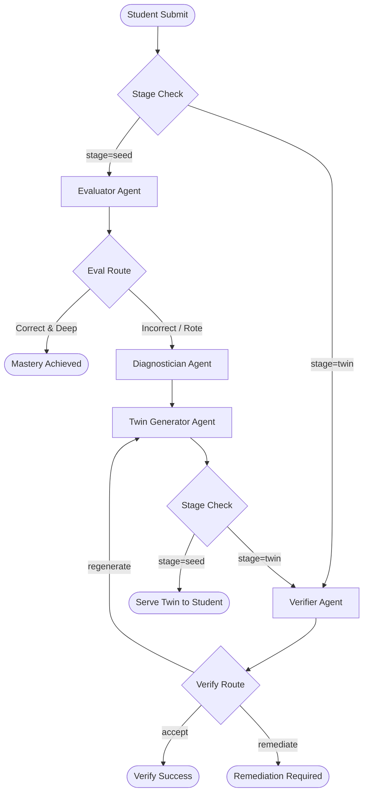

# System Architecture Specification

This document details the software architecture, agent coordination pipeline, and repository layout of **ConceptTwin**.

---

## 1. Directory Structure Overview

The codebase is organized into modular layers separating frontend presentation, API endpoints, agent behavior, and diagnostic data:

```
concept-twin/
├── docs/                      # Architectural and product documentation
│   ├── ARCHITECTURE.md
│   ├── LEARNING_LOOP.md
│   └── DEMO.md
├── src/
│   ├── app/                   # Next.js App Router structure
│   │   ├── api/
│   │   │   ├── session/       # Executes the LangGraph state flow
│   │   │   └── analyze-solution/ # Transcribes handwritten notepad files
│   │   ├── globals.css        # Visual styling system & keyframe rules
│   │   └── page.tsx           # Workspace page & student profile controller
│   ├── components/
│   │   └── PhysicsDiagram.tsx # SVG vector diagram renderer
│   ├── data/
│   │   ├── concepts.ts        # Sidebar Concept map definition
│   │   └── problems/          # Authoritative JEE diagnostic problems database
│   ├── lib/
│   │   ├── agents/            # Multi-agent implementations (Evaluator, Diagnostician, etc.)
│   │   ├── ai/                # Centralized Gemini Client queue and retry system
│   │   └── orchestration/     # LangGraph StateGraph design and state updates
│   └── types/
│       └── physics.ts         # Authoritative TypeScript physics schemas
```

---

## 2. Multi-Agent Orchestration via LangGraph

ConceptTwin coordinates four distinct agent nodes using stateful **LangGraph** transitions. State transitions are governed by the student's solution correctness and the presence of surface-level reasoning:



### Agent Node Roles

*   **Evaluator** (`src/lib/agents/evaluator.ts`): Evaluates final numerical correctness, transcribes step-by-step logic, and determines if reasoning indicates rote pattern-matching rather than deep understanding.
*   **Diagnostician** (`src/lib/agents/diagnostician.ts`): Analyzes reasoning steps against static physics misconception vectors (e.g. calculation slip, sign convention, coordinate mismatch).
*   **Twin Generator** (`src/lib/agents/twin-generator.ts`): Synthesizes an isomorphic follow-up challenge containing identical mathematical invariants under a different visual physical dressing.
*   **Verifier** (`src/lib/agents/verifier.ts`): Validates physical correctness of generated twins (preventing LLM hallucinations) and grades student responses on the twin problem.

---

## 3. Server-Side Rate Limit Queue & Session Locks

To guarantee high availability and stability, ConceptTwin implements server-side protection wrappers:

1.  **Throttling Queue** (`src/lib/ai/gemini.ts`): Enqueues all outgoing Gemini API calls into a sequential Promise queue, enforcing a minimum gap of `1.5 seconds` between consecutive requests to prevent burst rate limits.
2.  **Adaptive Retry Backoff**: Handles rate limits (429) automatically inside `generateText` up to 2 times, pausing 2s/5s or respecting server-side headers.
3.  **Compounding Abort**: Instructs calling wrappers to immediately fail on authentication or rate-limit issues, preventing nested loops from amplifying requests.
4.  **Session Concurrency Lock** (`src/app/api/session/route.ts`): Implements an active session set to reject parallel submissions for the same session ID.
