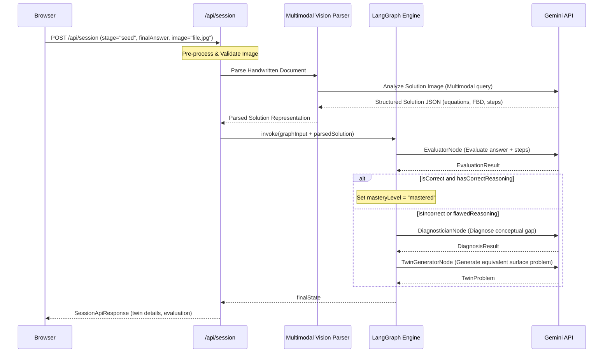

# ConceptTwin: Complete End-to-End Product Workflow

## 1. Product Purpose
Conventional physics question banks (such as standard JEE/NEET test prep portals) suffer from a critical flaw: they optimize for passive question browsing, rote formula lookup, and superficial pattern-matching. Students often memorize how to solve specific, familiar looking problems without grasping the underlying physics principles. Consequently, when presented with a slight variation in a different context, they fail.

**ConceptTwin** changes the paradigm: **"Don't tell the student what they know. Make them demonstrate it."** 
It establishes a rigorous learning loop where students must explain *why* they performed each step, and then prove their conceptual transfer by solving a dynamically synthesized "Concept Twin"—a problem with a completely different surface appearance but the identical deep mathematical and physical structure.

---

## 2. Target Users
ConceptTwin targets high-stakes physics preparation where deep conceptual understanding is the bottleneck to success:
*   **Class 11 Students:** Grasping core mechanical concepts (Forces, Circular Motion, Work-Energy) for the first time.
*   **Class 12 Students:** Master electromagnetism, optics, and modern physics.
*   **JEE Aspirants (Mains/Advanced):** Students facing highly creative, multi-concept problems where simple formula memorization fails.
*   **NEET Aspirants:** Medical prep students requiring rapid, accurate conceptual execution without mathematical overhead.
*   **Board-Exam Students:** Students needing to articulate derivation steps and step-by-step reasoning clearly.

*Scalability Note:* While the MVP targets Class 11 Mechanics (Laws of Motion), the data schemas, metadata structures, and AI prompt pipelines are fully generic and scale seamlessly to any math/science curriculum.

---

## 3. Student Onboarding
Onboarding establishes a personalized student profile used to initialize the adaptive mastery engine:
*   **Name:** Personal identity.
*   **Class:** Grade level (e.g., Class 11, Class 12, Dropper).
*   **Exam Profile:** JEE Mains, JEE Advanced, NEET, or CBSE Boards.
*   **School/Institution (Optional):** Contextual tracking.
*   **Subject:** Current study focus (e.g., Physics).
*   **Active Chapter & Concept:** The initial starting point chosen by the student or recommended by the system.

*Prerequisite Recommendation:* If a student selects a complex concept, the system evaluates their historical performance on prerequisite concepts and offers an automatic diagnostic run to verify their foundations.

---

## 4. Curriculum Hierarchy
The platform's content is organized as a structured, scalable directed graph:
```
Class (e.g., Class 11)
  └─ Exam (e.g., JEE Mains)
       └─ Subject (e.g., Physics)
            └─ Chapter (e.g., Laws of Motion)
                 └─ Topic (e.g., Friction)
                      └─ Concept (e.g., Friction on an Inclined Plane)
                           └─ Prerequisites (e.g., Resolve Components of Force)
```
Prerequisite links allow the system to trace learning gaps backward. If a student fails "Friction on an Inclined Plane" due to poor vector resolution, the system recommends stepping back to the prerequisite vector concept.

---

## 5. Handwritten Solution Input
ConceptTwin supports two ways for students to submit their solution attempts:
1.  **Typed Solution:** Text inputs containing equations and final numerical answers.
2.  **Handwritten Solution Upload:** An uploaded image/photo of the student's paper-based solving sheet.

This is especially critical for Indian students preparing for JEE, NEET, and board examinations, who naturally solve numerical and conceptual problems on paper using a pen or pencil.

### Multimodal Vision Pipeline
The image analysis is **not** treated as simple OCR (Optical Character Recognition). A specialized Multimodal Gemini Vision model acts as the input parser to decode:
*   **Handwritten Equations:** Deciphers math scripts, coordinate systems, and symbols.
*   **Diagrams & Free Body Diagrams (FBDs):** Analyzes geometric vectors, force arrows, and coordinate alignments drawn by the student.
*   **Crossed-Out Work:** Distinguishes between active calculations and discarded scratch paths.
*   **Annotations:** Detects marginal notes, comments, or coordinate markers.
*   **Reasoning Sequence:** Reconstructs the logical chronological flow of calculations.
*   **Honest Uncertainty Handling:** If handwriting is illegible, low-contrast, or cut off, the vision engine flags this as "low-confidence/ambiguous" rather than hallucinating mathematical contents.

---

## 6. PYQ Diagnostic System
Every learning session begins with a curated **Previous Year Question (PYQ)** which acts as the diagnostic anchor.
*   **Diagnostic Anchor:** Real, high-quality exam questions (e.g., JEE 2023) ground the learning loop in actual exam standards.
*   **Dual Capture Inputs:** Students cannot proceed by guessing a multiple-choice option. They must:
    1.  Read the question.
    2.  Attempt the problem on paper or via the keyboard.
    3.  Submit the final answer (optionally typed).
    4.  Upload an image/photo of the handwritten solution or type step-by-step reasoning.
*   **Active Engagement:** This stage is an active submission gate, not a passive solution-reading screen.

---

## 7. AI Evaluation
When the student submits their solution, the **Evaluator agent** runs. In the case of an image upload, the multimodal vision parser translates the photo into a structured representation (math equations, identified FBD vector nodes, logical steps, final value) before evaluation. The Evaluator then analyzes:
*   **Correctness:** Matches the final answer against the trusted answer key.
*   **Reasoning Quality:** Parses the derivation steps (from typed text or decoded vision representation) to verify that the student used the correct physical laws rather than mathematical coincidence.
*   **Procedural Errors:** Identifies calculations or algebraic slips.
*   **Conceptual Errors:** Detects invalid assumptions (e.g., assuming $N = mg$ blindly).

The Evaluator classifies the result into four distinct profiles:
1.  **Correct Answer + Correct Reasoning:** Mastery demonstrated on this anchor (Mastered).
2.  **Correct Answer + Flawed/Rote Reasoning:** Surface pattern-matching detected. (Requires support).
3.  **Incorrect Answer + Partially Correct Reasoning:** Calculation slip or procedural error.
4.  **Incorrect Answer + Conceptual Misconception:** Core concept gap.

---

## 8. Misconception Engine
If a gap is identified, the **Diagnostician agent** is triggered. It maps the student's errors into specific, actionable misconception profiles:
*   **Conceptual Misunderstanding:** Mistaking static friction for kinetic friction.
*   **Incorrect Formula Selection:** Using constant acceleration equations ($v = u + at$) when acceleration varies.
*   **Sign / Coordinate Error:** Failing to project gravity components correctly along the inclined axis.
*   **Mathematical / Calculation Error:** Basic arithmetic mistakes.
*   **Diagram / FBD Error:** Omitting normal force or friction vectors (directly extracted from the student's handwritten sketches).
*   **Unit / Dimensional Error:** Incorrectly scaling grams to kilograms or mixing SI and non-SI units.

---

## 9. Concept Twin Generation
If a gap is diagnosed, the **Twin Generator agent** synthesizes a customized follow-up problem:
*   **Invariant Deep Structure:** The underlying physics laws, equations, and mathematical relationships remain identical to the anchor.
*   **Variable Surface Features:** The physical situation, characters, quantities, and context are completely transformed.
    *   *Example PYQ:* A block sitting inside an accelerating elevator (Normal force).
    *   *Concept Twin:* A skateboarder riding over a circular hump, or a spacecraft launch (Normal force).
*   **Creative Variation:** The system avoids generating trivial changes (e.g., merely changing mass from $2\,\text{kg}$ to $4\,\text{kg}$). It forces the student to generalize the concept to a new scenario.

---

## 10. Adaptive Quiz Engine
Instead of serving static, pre-defined question banks, the student travels through an adaptive, responsive learning graph:
*   **Initial PYQ** $\rightarrow$ Student fails.
*   **Twin 1** is generated and served based on the diagnosed misconception.
*   Student solves **Twin 1** (typing or uploading a handwritten photo) and submits.
*   If **Twin 1** is correct with sound reasoning, the engine awards mastery or presents a slightly harder twin to confirm transfer.
*   If **Twin 1** fails, the engine triggers the **Remediation Loop**.

---

## 11. Remediation Loop
If the student fails the first Concept Twin:
1.  **Diagnosis Update:** The system adjusts its understanding of the student's conceptual gap.
2.  **Targeted Hint/Scaffolding:** Rather than showing the solution, it displays a step-by-step breakdown of the misconception (e.g., explaining how normal force is constraint-based, not a constant).
3.  **Downwards Adaption:** Generates an easier, simplified Concept Twin (focusing only on the core sub-concept, like finding acceleration on a flat surface).
4.  **Gradual Escalation:** Once the student proves understanding, they are escalated back to a medium/hard twin.

---

## 12. Concept Mastery Model
Mastery is calculated dynamically as a composite score, not a binary correct/incorrect flag:
*   **Accuracy (40%):** Rate of correct final answers.
*   **Reasoning Quality (40%):** Depth and correctness of step-by-step derivations extracted from written text or parsed handwriting.
*   **Transfer Consistency (20%):** Performance across multiple surface-level variations of the same deep structure.
*   **Remediation Factor:** Slashes mastery scores if multiple remediation loops are required before achieving success.

---

## 13. Concept Map
Student progression is governed by a visual Concept Map tracking concept states:
*   `Locked`: Prerequisites are not yet met.
*   `Unlocked`: Prerequisites completed; ready to attempt.
*   `Active`: Diagnostic anchor failed; student is actively working on twins.
*   `Mastered`: Conceptual transfer proven; unlocks dependent nodes.

---

## 14. Student Dashboard
Provides clear, actionable insights into cognitive progress:
*   **Mastery Index:** Overall chapter and concept completion rates.
*   **Active Gaps:** List of concepts currently in the `Active`/Remediation state.
*   **Misconception Library:** Highlighted common pitfalls the student repeatedly makes (e.g., "Sign Conventions" or "FBD Coordinate Alignment" detected via handwritten sketches).
*   **Recommended Next Steps:** Automatic selection of unlocked concepts based on syllabus priority.

---

## 15. Content / Question Bank Architecture & Student Attempt Data Model
Curated problems and student attempts carry extensive metadata to support adaptive routing:

### Question Metadata
```json
{
  "problemId": "prob-fbd-01",
  "source": "JEE Mains 2021",
  "class": 11,
  "subject": "Physics",
  "chapter": "Laws of Motion",
  "topic": "Newton's Second Law",
  "conceptId": "concept-elevator-normal-force",
  "difficulty": "easy",
  "question": "A book of mass 2 kg rests on a table inside an elevator accelerating upwards at 2 m/s²...",
  "correctAnswer": "24",
  "unit": "N",
  "reasoning": "Using F = ma: N - mg = ma => N = m(g + a) = 2 * (10 + 2) = 24 N.",
  "prerequisites": ["concept-fbd-vector-components"]
}
```

### Student Attempt Data Model
```json
{
  "attemptId": "att-9812-76a",
  "problemId": "prob-fbd-01",
  "stage": "seed",
  "inputType": "image",
  "imageMetadata": {
    "format": "jpeg",
    "sizeBytes": 142048,
    "dimensions": "1200x1600"
  },
  "parsedContent": {
    "extractedAnswer": "20",
    "equationsFound": ["N = mg", "N = 2 * 10 = 20"],
    "hasFbdSketch": true,
    "fbdConfidence": 0.92,
    "confidenceScore": 0.88,
    "uncertaintyWarning": null
  },
  "rawTextInput": "",
  "clientTimestamp": "2026-08-29T10:34:00Z"
}
```

---

## 16. MVP Content Strategy
For the LV8 hackathon, the system demonstrates full vertical depth on a focused scope:
*   **Syllabus:** Class 11 Physics $\rightarrow$ Laws of Motion $\rightarrow$ Friction & Forces.
*   **Core Concepts (4–6):**
    1.  Vertical normal force in accelerating systems (Elevator).
    2.  Static vs kinetic friction threshold on horizontal planes.
    3.  Resolving gravity on inclined planes.
    4.  Tension in single-pulley systems (Atwood machine).

---

## 17. Complete User Journey
1.  **Enter & Align:** Student logs in, selects Class 11 and "Laws of Motion".
2.  **Target Concept:** Student chooses "Normal Force in Accelerating Systems".
3.  **Diagnostic Anchor:** Platform serves the seed PYQ (`prob-fbd-01`).
4.  **Attempt on Paper:** Student solves the problem on paper, gets $20\,\text{N}$, and draws a basic free-body diagram.
5.  **Image Submission:** Student takes a photo of their page using a mobile camera and uploads the JPEG to the ConceptTwin workspace, typing "20 N" in the final answer box.
6.  **AI Vision Parsing:** The multimodal vision model processes the JPEG, extracts the equation $N = mg$, identifies that the elevator acceleration was omitted from their FBD, and sets the structured representation.
7.  **Evaluate:** AI Evaluator marks the attempt incorrect.
8.  **Diagnose:** AI Diagnostician detects misconception: "Assumed normal force equals gravity blindly ($N=mg$), ignoring system acceleration ($a$)."
9.  **Twin Generation:** Twin Generator synthesizes a new context: "A rocket cabin containing a $10\,\text{kg}$ cargo trunk accelerating upwards at $5\,\text{m/s²}$..."
10. **Attempt Twin:** Student resolves forces on paper, uploads another photo showing $N - mg = ma \implies N = 10(10+5) = 150\,\text{N}$.
11. **Verify & Master:** AI Verifier validates the handwritten math layout. Mastery increases, the Concept Map updates, and the concept turns green (`Mastered`).

---

## 18. Hackathon Differentiation
Unlike existing edtech platforms:
*   **Static Question Banks:** Serve endless random questions without understanding *why* a student failed.
*   **AI Question Generators:** Create generic questions without preserving deep structural equivalence.
*   **Tutoring Chatbots:** Give away the answers passively, encouraging cognitive dependency.
*   **ConceptTwin** builds a cognitive model of the student, reads and analyzes their natural **handwritten paper solutions (including diagrams and scratchpad notes)**, isolates their specific conceptual bugs, and forces them to demonstrate mastery actively through structural transfer.

---

## 19. Technical Responsibilities
*   **Curriculum / Data Layer:** Stores topics, concepts, and prerequisite links.
*   **Question Bank:** Hosts curated seed problems with complete physical answers and reasoning.
*   **Student Attempt Layer:** Handles session creation, saves student logs, supports image uploads, and coordinates attempts.
*   **AI Vision Parser (New Capability):** Validates and pre-processes image files (JPG, PNG, JPEG), calls the Multimodal Gemini model to output structured text/JSON containing parsed steps, FBD descriptions, and calculations.
*   **AI Evaluation Layer:** Executes `evaluatorNode` using structured schemas to verify correctness.
*   **Misconception Engine:** Executes `diagnosticianNode` to identify conceptual failures.
*   **Concept Twin Generator:** Executes `twinGeneratorNode` to synthesize new problems.
*   **Mastery Engine:** Reducer logic that updates mastery scores.
*   **UI/UX Layer:** Displays the technical dark-mode workspace, supporting paper solution upload widgets, visual concept maps, and step-by-step diagnostic feedback.

---

## 20. Data Flow


---

## 21. Product Principles
1.  **Prioritize Reasoning over Correctness:** A correct answer obtained through flawed steps is marked as a failure.
2.  **Multimodal Equality:** Paper-based handwritten uploads are parsed with the same structural fidelity as typed text solutions.
3.  **Preserve Handwriting Ambiguity:** If handwriting is illegible, report verification uncertainty rather than guessing equations.
4.  **Ensure Structural Invariance:** A concept twin must test the identical physical laws; it is never a random physics question.
5.  **Prevent Passive Learning:** No answers are shown directly; the student must earn progression by solving the twin.
6.  **Deterministic Integrity:** The Gemini model output must strictly validate against standard schemas before updating state.
7.  **Scale Beyond Subject Boundaries:** The multi-agent LangGraph architecture must remain subject-agnostic.
