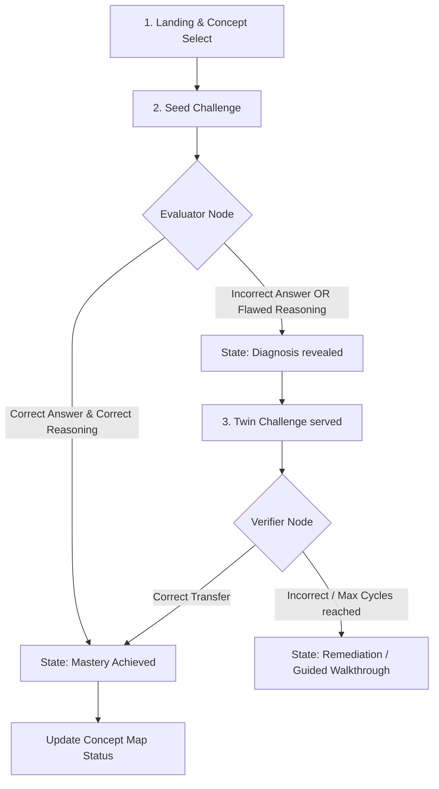

# ConceptTwin — UX Architecture Specification

This document details the user experience (UX) architecture for **ConceptTwin**, an AI-native physics learning application.

---

## 1. Product Experience Philosophy

EdTech platforms commonly act as passive content delivery networks or conversational chatbots that give answers away. **ConceptTwin** is built on a single, uncompromising principle:

> **"Don't tell the student what they know. Make them demonstrate it."**

### Core Pillars
*   **Anti-Chatbot / Active Solving**: ConceptTwin avoids conversational message inputs where students can passively ask for answers. Instead, the interface features a split-pane layout: a **Problem Space** on the left and a structured **Workspace** (Math/Reasoning editor + Answer box) on the right.
*   **Deep Structure vs. Surface Features**: The UI makes this core pedagogical concept visually clear. When a student solves a problem by rote formula lookup ("surface pattern matching"), the system exposes it and challenges them with a **Twin Problem**—a problem with different surface dressing (e.g. from an elevator to a rocket cabin) but identical physics invariants.
*   **Immediate, High-Fidelity Feedback**: No generic error messages. The system dissects the student's step-by-step working and points directly to the misconception (e.g. "You assumed Normal Force always equals static weight ($N=mg$), ignoring the vertical acceleration of the system").

---

## 2. User Journey: From Landing to Mastery



### The Steps:
1.  **Discover**: Student enters a clean, premium workspace. A minimalist **Concept Map** shows 5 core physics topics (Newton's Laws & Friction). Locked/unlocked status and current mastery levels are visible.
2.  **First Attempt (Seed)**: Student selects a concept and is served an authentic, hand-crafted **Seed Problem**. They write their step-by-step working and input a final numerical value.
3.  **Assessment**: The system evaluates both the final answer and the reasoning.
    *   If they pass both: They immediately earn **Mastery** for this concept.
    *   If they fail either: They see their diagnosis (the specific conceptual gap) and are served a **Twin Challenge** designed to expose this gap.
4.  **The Twin Battle**: The student attempts the twin problem. The Verifier assesses whether conceptual transfer occurred. If successful, they achieve **Mastery**. If they fail repeatedly (max 3 cycles), they are routed to **Remediation**.

---

## 3. Complete Screen / Page Structure

To maintain maximum focus and eliminate distraction, ConceptTwin uses a **single-page workspace layout** with a persistent navigation/dashboard layer.

### Pages & Sub-views:
1.  **Workspace View (`/`)**: 
    *   **Sidebar**: Toggleable Concept Map, progress indicators, and historical stats.
    *   **Central Split Pane**:
        *   *Left Pane*: Active Problem (Seed or Twin) + Concept Metadata card. Includes custom SVG/CSS inline vector rendering for physics diagrams.
        *   *Right Pane*: Student Input area (rich working text area + numeric input + Submit).
    *   **Feedback Overlay / Bottom Panel**: Slides up when evaluation/diagnosis is ready.
2.  **Concept Selection View**:
    *   A visual node graph representing the 5 concept clusters:
        1. Free-Body Diagrams & Force Identification
        2. Newton's Second Law / Net Force
        3. Friction & Direction of Friction
        4. Inclined Plane Problems
        5. Connected Bodies / Pulley Systems
3.  **Mastery Splash (Celebration State)**:
    *   Dynamic particle animation with a breakdown of what the student successfully demonstrated.
4.  **Remediation View**:
    *   Step-by-step interactive derivation walkthrough of the concept.

---

## 4. Main Learning Screen Layout

```
+-----------------------------------------------------------------------------------+
|  ConceptTwin  [ Newton's Laws + Friction ]                    [ Progress: 2/5 ]   |
+-----------------------------------------------------------------------------------+
|  [CONCEPT MAP]     |  PROBLEM PANE (Left)        | WORKSPACE PANE (Right)         |
|                    |  Target Concept:            | Write your step-by-step        |
|  (o) FBDs          |  Free-Body Diagrams         | working/derivation here:       |
|      [Mastered]    |                             | +----------------------------+ |
|                    |  Problem:                   | | N - mg = ma                | |
|  (*) Net Force     |  A 2 kg book rests on a     | | N = m(g + a)               | |
|      [Solving...]  |  table in an elevator       | | N = 2 * (10 + 2)           | |
|                    |  accelerating upward...     | | N = 24 N                   | |
|  ( ) Friction      |                             | +----------------------------+ |
|      [Locked]      |  Given variables:           | Final Answer:                  |
|                    |  m = 2 kg, a = 2 m/s^2      | [ 24 ] N                       |
|  ( ) Inclines      |                             |                                |
|      [Locked]      |                             | [ SUBMIT ANSWER ]              |
|                    |                             |                                |
+--------------------+-----------------------------+--------------------------------+
|  FOOTER: System Status [Idle]                                                     |
+-----------------------------------------------------------------------------------+
```

*   **Split ratio**: 45% (Problem Context + Concept Info) | 55% (Interactive Solving Workspace).
*   **Theme**: Premium light-first theme base (warm off-white foundation `#F8FAFA`) with high-contrast active accents (`#77FFFC` / `#008f8c`) and charcoal typography (`#1A2020`).

---

## 5. Student Interaction States

The interface shifts dynamically through these distinct states:

| State | Trigger | UI Behavior |
| :--- | :--- | :--- |
| **Idle** | Initial load / Concept chosen | Problem loaded. Workspace empty. Submit button disabled. |
| **Solving** | Student starts typing | Timer starts. Input field displays live count. Submit button active. |
| **Submitting** | Click "Submit Answer" | Inputs lock. Spinner displays over submit button. |
| **Evaluating** | API call in progress | Ambient pulse animation on left/right panes indicating AI processing. |
| **Mastered** | API returns `nextAction: 'mastered'` or `'twin_accepted'` | Confetti effect. Workspace locks. Big "Next Concept" button appears. |
| **Diagnosis** | API returns `nextAction: 'show_twin'` | Workspace split pane highlights in amber. Error feedback cards display. |
| **Twin Challenge**| Click "Accept Challenge" | Left pane transitions to the Twin Problem with custom entry animations. |
| **Verification** | Student submits Twin | Inputs lock. Verification-specific spinner. |
| **Remediation** | API returns `nextAction: 'remediation'` | Split pane merges into a single central panel containing structured explanations. |

---

## 6. Information Visibility Matrix

To ensure pedagogical integrity, certain data remains strictly hidden from the client until they have completed their attempt:

| Information Item | Seed Stage | Diagnosis Stage | Twin Solving Stage | Verified Stage |
| :--- | :--- | :--- | :--- | :--- |
| **Seed Question** | **VISIBLE** | **VISIBLE** | **VISIBLE** | **VISIBLE** |
| **Seed Correct Answer** | *HIDDEN* | **VISIBLE** | **VISIBLE** | **VISIBLE** |
| **Seed Step-by-Step Reasoning** | *HIDDEN* | **VISIBLE** | **VISIBLE** | **VISIBLE** |
| **Evaluator Identified Mistakes** | *HIDDEN* | **VISIBLE** | **VISIBLE** | **VISIBLE** |
| **Misconception Classification** | *HIDDEN* | **VISIBLE** | **VISIBLE** | **VISIBLE** |
| **Twin Question** | *HIDDEN* | *HIDDEN* | **VISIBLE** | **VISIBLE** |
| **Twin Correct Answer** | *HIDDEN* | *HIDDEN* | *HIDDEN* | **VISIBLE** |
| **Twin Step-by-Step Reasoning** | *HIDDEN* | *HIDDEN* | *HIDDEN* | **VISIBLE** |
| **Transfer Score / Feedback** | *HIDDEN* | *HIDDEN* | *HIDDEN* | **VISIBLE** |

---

## 7. Concept Map Behavior and States

The Concept Map is the visual navigation system, represented as a progressive subway line or dependency tree.

### Concept Nodes & Statuses:
*   **Locked**: Pale gray node, padlock icon. Hovering shows "Prerequisite: [Prereq Name]". Cannot be clicked.
*   **Available / Unlocked**: Border, hollow node. Student can click to initiate the Seed challenge.
*   **Active / Solving**: Glowing pulse indicator. The current problem session is tied to this node.
*   **Mastered**: Filled emerald node, checkmark badge. Student can review past working but cannot "lose" mastery.
*   **Needs Remediation**: Filled amber/red node, alert icon. Highlighted indicating student should enter the remediation walkthrough.

---

## 8. Error, Loading, and AI Failure States

Since we rely on generative AI, handling network latency and parsing failures gracefully is critical.

*   **Loading State**: A progressive step-indicator loader card shows exactly what the AI engine is doing (e.g. `Reading Solution` -> `Evaluating Reasoning` -> `Detecting Concept Gaps` -> `Building ConceptTwin` -> `Verifying Understanding`).
*   **Rate Limiting & Session Locks**: Handles multi-request bursts with sequential execution queueing, falling back to clean retry states without locking the browser workspace.
*   **Zod Validation Failure**: If the engine outputs malformed JSON, the route automatically retries. If all retries fail, we fallback to a safe static diagnostic template (arithmetic/procedural check) so the user journey never breaks.

---

## 9. Responsive & Desktop Layouts

*   **Desktop (1440px+)**: Full 3-column layout. Sidebar Concept Map is persistently visible on the left. Split-pane problem space and workspace sit side-by-side.
*   **Laptop (1024px - 1440px)**: Sidebar collapses into a slide-out drawer. Problem and workspace panes scale fluidly using flexbox.
*   **Mobile / Small Tablet (Below 1024px)**: Stacked single-pane layout. Tab bar at the top allows switching between the `Problem` and `Workspace` views.

---

## 10. Accessibility Considerations

*   **Keyboard Navigation**: The math workspace is fully focusable. Tab indices move logically from Problem reading -> Working text area -> Final answer input -> Submit button.
*   **LaTeX Rendering Accessibility**: All LaTeX elements (equations, problem text) render using KaTeX with accessible MathML output.
*   **Contrast Ratios**: The light theme uses slate grays and off-whites that strictly adhere to WCAG AAA contrast guidelines.

---

## 11. Testing & Assessment Presets

The interface supports diagnostic presets (selectable during onboarding) to test distinct routing states:
*   **Preset 1: Rote Solver (Elevator)**: Pre-populates the workspace with a rote-pattern answer to demonstrate gap detection and twin generation.
*   **Preset 2: First-Principles Master**: Demonstrates direct concept mastery verification.
*   **Preset 3: Calculation Slip**: Triggers minor arithmetic slippage flows.
